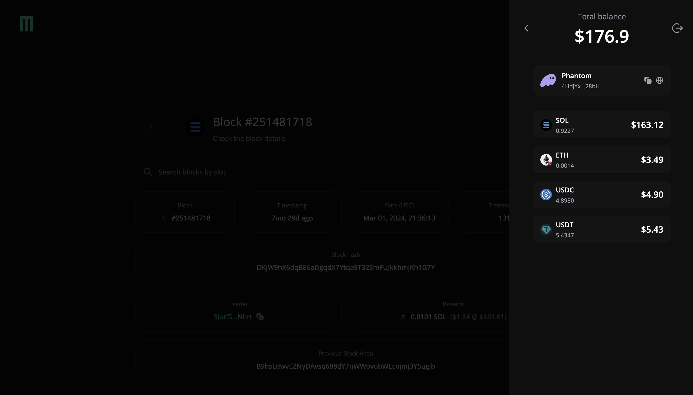
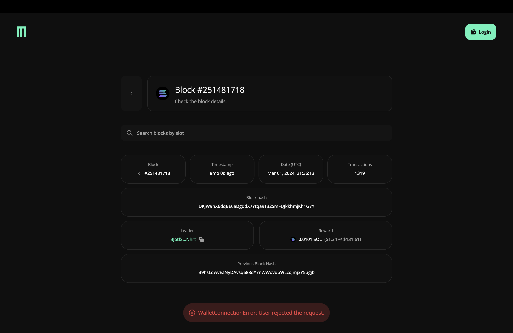

## Solana Block Explorer - Assignment

### Overview

**Assignment Objective**: Build a Solana block explorer application that allows users to connect their wallet, view recent blocks, and explore detailed block information.

### Project Scope

#### Functional Requirements

- **Block Explorer**: A main dashboard displaying recent Solana blocks, including attributes such as block hash, timestamp, transaction count, and reward information.
- **Detailed Block View**: A dedicated page for individual blocks with additional information, and the ability to navigate to adjacent blocks.
- **Wallet Integration**: Users can connect their Solana wallet, view their SOL and token balances, and see the total balance in USD

### Getting Started

#### Clone the Repository and Install Dependencies

```bash
git clone https://github.com/williamslsy/sol-block-explorer.git

cd sol-block-explorer

npm install && npm run dev

OR

yarn && yarn dev
```

#### The .env variables required to run the app

```bash
NEXT_PUBLIC_ALCHEMY_API_KEY=<your_alchemy_key>
```

## Tools and Technologies Used

- **Next.js**: For efficient SSR, static generation, and routing.
- **Solana Wallet Adapter**: Simplifies wallet integration, specifically for Solana.
- **Tailwind CSS**: Provides utility-based styling.
- **Shadcn-UI**: For consistent, accessible UI components.
- **Alchemy API**: To fetch Solana blockchain data.
- **Token Price API**: Fetches live prices for SOL and tokens.

## Using the Application

1.  **Connecting a Wallet**:

    - Click the "Login" button on the header.
    - Choose the Phantom wallet (the primary supported wallet in this setup).
    - After connecting, view your SOL and token balances, converted to USD.



2.  **Exploring Blocks**:

    - The homepage lists recent blocks with details like block hash, timestamp, transaction count, and rewards.
    - Click on a block to view additional details.

3.  **Detailed Block View**:

    - Navigate to previous or next blocks using navigation links.
    - See details like leader, reward, and block hash.

## Application Structure

### Core Components

- **Home (`Home.tsx`)**:

  - Displays the headline, search bar, and block table.
  - Uses `HeadLine`, `SearchBar`, and `BlockTable` components.

- **SearchBar (`SearchBar.tsx`)**: Includes a search input that filters blocks by slot and allows navigation to the selected block.
- **BlockTable (`BlockTable.tsx`)**: Lists recent blocks, displaying essential block data with clickable rows for navigation.
- **Block Details (`BlockDetails.tsx`)**:

  - Displays in-depth information on a specific block, with "Previous" and "Next" navigation.
  - Shows leader, block hash, reward in both SOL and USD, and transaction count.

### Wallet Integration and Contexts

- **Balance Context (`BalanceProvider.tsx`)**:

  - Fetches and manages SOL and token balances from the connected wallet.
  - Calculates the total USD value using token prices.
  - Contains error handling to provide feedback in case of API issues.

- **Wallet Modal (`WalletModalProvider.tsx` and `CustomWalletModal.tsx`)**:

  - A custom modal for wallet connection with support for **Phantom**.

### Utility Functions and Hooks

- **Token Data (`useTokenData.ts`)**: Fetches token metadata (symbol, logo, address) for displaying token balances.
- **Formatting Utilities (`utils.ts`)**: Formats timestamps and truncates long strings (e.g., hashes) for cleaner UI.
- **Error Handling with Toasts (`Toast.tsx`)**: Provides feedback on successful and failed operations, with styling variations for success and error states.
- **Server Utilities (`server-utils.ts`)**:
  - `fetchTokenPrices`: Fetches live token prices (SOL, USDC, USDT, ETH) from CoinGecko to convert token balances into USD values.
  - Used to keep token pricing up-to-date, with error handling for any issues in data fetching.

### Challenges and Solutions

1. **Integrating Solana Wallet Adapter**:
   - Faced initial challenges in integrating the Solana Wallet Adapter. Specifically, customizing the modal provided by the adapter to fit the design system. To resolve this, I built a custom modal that maintains the design consistency and provides a seamless user experience.
2. **Unknown Tokens for SPL Balances**:

   - When attempting to display all SPL tokens, some tokens appeared as **Unknown Token**. To address this, I opted to display only specific, commonly recognized tokens (SOL, USDC, USDT, and ETH) for a more controlled user experience.

3. **Dynamic Error Handling with Toasts**:
   - Implemented error handling with toasts to provide instant user feedback. This includes handling API errors for token prices and Solana block data, ensuring users are informed of any issues as they interact with the app.



### Areas for Improvement

---

- **Real-Time Balance Updates**: Implementing automatic balance refresh to seamlessly update user balances in real-time as they change in the user's connected Phantom wallet.

- **Enhanced Mobile Responsiveness**: Mobile responsiveness is a key priority, and while adjustments have been made, achieving a fully optimized experience requires a dedicated mobile design for refining the interface to ensure an exceptionally smooth user experience on smaller screens.

- **Additional Features**: For a more comprehensive user experience in a production-ready version, implementing real-time block data, advanced wallet support, and detailed token information could significantly enhance the application’s utility and depth.
